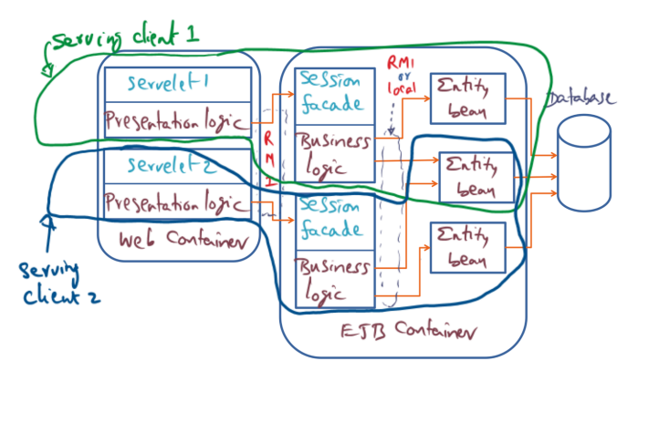

# Lesson 5: Distributed Systems (27 points)

## 1. Lamport's Logical Clock (8 points)

A student has implemented a distributed algorithm using Lamport’s happened-before relationship to timestamp the events. She is in the middle of debugging the program. She observes the following events for each processor. Each event is tagged with the local timestamp recorded for the event on that processor following Lamport’s logical clock.

| P1                        | P2                       | P3                       |
|---------------------------|--------------------------|--------------------------|
| 1: msg-send (to ???)      |                          | 1: local event           |
|                           | 2: msg-receive (from ??) | 2: msg-send (to ??)      |
|                           | 3: msg-receive (from ??) | 3: local event           |
|                           | 4: msg-send (to ??)      | 4: local event           |
| 5: msg-receive (from ???) | 5: msg-send (to ??)      |                          |
|                           |                          | 6: msg-receive (from ??) |

Please help her by identifying who is the sender/receiver for each message (namely, the sender, receiver, and the logical timestamp associated with that event.

In answering the question use the following format: `<processor-number>: <local-time>: msg-<send/receive> (<from>/<to>)`

(e.g., `P1: 20: msg-receive(P3)` would mean P1 received a message from P3 at local time 20)

---

| P1                      | P2                      | P3                      |
|-------------------------|-------------------------|-------------------------|
| 1: msg-send (to 2)      |                         | 1: local event          |
|                         | 2: msg-receive (from 1) | 2: msg-send (to 2)      |
|                         | 3: msg-receive (from 3) | 3: local event          |
|                         | 4: msg-send (to 1)      | 4: local event          |
| 5: msg-receive (from 2) | 5: msg-send (to 3)      |                         |
|                         |                         | 6: msg-receive (from 2) |

## 2. Lamport's Mutual Exclusion Algorithm (10 points) (hidden)

Every process maintains a queue of pending requests for entering critical section in order. The queues are ordered by virtual time stamps derived from Lamport timestamps.

Requesting process

1. Sending a request to every node.
1. Waiting for replies from all other nodes.
1. If own request is at the head of its queue and all replies have been received, enter critical section.
1. Upon exiting the critical section, remove its request from the queue and send a release message to every process.

Other processes

1. After receiving a request, pushing the request in its own request queue (ordered by time stamps) and reply with a time stamp.
1. After receiving release message, remove the corresponding request from its own request queue.

## 3. Latency Reduction in RPC (9 points) (hidden)

https://drive.google.com/file/d/18Oiq99TQYNg-D0h7Oyu9D9V2VEyxV-h0/view

# Lesson 6: Distributed Objects and Middleware (26 points) 

## 4. Spring OS (10 points)

You are managing a subset of nodes in a cluster. You have chosen to use Spring as the network OS for the cluster. You must host the following services:

1. A Postgres database server which is replicated on 3 nodes
1. A web server on 3 nodes
1. A web server load balancer that does ensures equitable CPU utilization on all the servers for the client requests.
1. A Postgres load balancer that does round-robin allocation of the servers for the client requests.

Each of the above servers and the load balancers are hosted on distinct nodes on the LAN. The clients are all on the same LAN and are expected to make requests to both the Postgres and Web service.

### 4.1 (6 points)

#### 4.1a

List the subcontracts needed on the client machines.

---

The clients will need a subcontract with the webserver load balancer and the Postgres load balancer.

#### 4.1b

List the subcontracts needed on the web server load balancer.

---

* The web server load balancer will need one subcontract for communication with the three webservers.
* This subcontract will need to be able to determine the CPU utilization of each web server and route a invocation to the web server with the lowest utilization.
* The subcontract will dynamically discover web servers on the network.
* The load balancer will also need a subcontract with the clients.

#### 4.1c

List the subcontracts needed on the Postgres load balancer.

---

* The Postgres load balancer will need one subcontract for communication with the three Postgres servers.
* The subcontract will perform round-robin distribution of requests, so it will need to maintain state to know which server to contact next.
* The subcontract will dynamically discover Postgres instances on the network.
* The load balancer will also need a subcontract with the clients.

### 4.2 (2 points)

You decide to beef up your web server with 2 more nodes. What changes will you need to make to ensure that the client requests can utilize the two new nodes?

---

* No change is needed.
* The client contacts the load balancers which dynamically discover their respective instances.

### 4.3 (2 points)

You now need to access the Postgres database from the web service. What changes do you need to make to the system?

---

* The web servers will need a subcontract with the Postgres load balancer.
* The Postgres load balancer will need a corresponding subcontract.

## 5. Entity Java Beans (10 points)

It is circa 2002. Yelp and Google Reviews don’t exist yet. You’re a developer and a foodie. You decide to build a restaurant review website that has the following functionalities:

1. Accept a restaurant name or a cuisine as input and display a list of restaurants with their ratings.
1. If a user clicks on a restaurant, they will be shown the reviews for the restaurant.
1. The user should be able to sort restaurants by distance from their location, and average review score.
1. Allow a user to post a review about a restaurant and store it in the database, along with some keywords (e.g., cuisine, ambience, etc.), which may or may not explicitly be provided by the user.

Now you realize that restaurant searches are hyper-local, so you only need to show the user the restaurants which are within a 15-mile radius. So, you decide to use the user’s GPS location to filter results.

You decide to implement the system with the state of the art, i.e., EJB entity beans as shown below:



### 5.1 (6 points)

For the functionality that you need on the website, describe concisely what components go into the presentation logic, business logic and the entity beans. 

---

Presentation logic:

* Interacts with the client
* Controls (e.g. HTML, CSS) for searching, sorting, filtering
* Controls for publishing reviews
* Logic for rendering reviews and restaurants
* On search the presentation logic will call the business logic with the desired searching, sorting, and filtering parameters
* When posting a review the presentation logic will pass the review information to the business logic
* GPS data is passed from the client to the business logic for additional filtering

Business logic:

* Validation of requests
* Bridge between presentation logic and entity beans
* Forwards searches from the presentation logic to entity beans
* Could potentially perform searching, filtering, and sorting, but it would be more efficient to do this in the database
* When posting reviews the business logic interacts with the entity beans to create a new database record to persist the review information. It may also perform any special logic to handle optional/missing fields

Entity beans:

* Interacts with a database to persist and query data such as restaurants and reviews
* Provides mechanisms to search for restaurants and reviews based on some criteria
* Acts as the bridge between the database and Java objects

### 5.2 (2 points)

How would you optimize for latency for concurrent requests from users in the same location?

---

* I am limiting my answer to optimizing EJB. There are plenty of well-known general techniques for reducing latency in a web service that I am considering as out-of-scope for this answer.
* Stateless session beans could be used to exploit database connection pooling. The bean could be modified to add a simple key/value cache.
* Stateful session beans would be unlikely to be very useful. No part of the application necessitates client state.


### 5.3 (2 points)

You decide to open shop in India, where there are 22 official languages. You realize that restricting yourself to English might be a problem. Where in this framework would you add the functionality to render content in different languages? Justify your answer (No points without justification).

---

All layers will need to support a string encoding format that supports India's 22 languages. Java uses UTF-8 by default. Let's assume that all layers were designed to support UTF-8, and that UTF-8 is a good fit for the languages we're displaying.

* The presentation layer will need to be updated so that users can select their preferred language(s)
  * The presentation layer could optionally be updated to automatically translate user-submitted text (e.g. reviews) with a technology like Google translate
  * Otherwise we should provide a filter so that we only show reviews that the user can understand
  * We may also want to allow restaurants to display which languages they speak, so that a customer knows they will be well served there
* The business logic will need to support the new language filter
* The entity beans will need to be updated to store our new languages fields, and expose methods for searching/filtering
* The database schema will likewise need to be updated for the new fields

## 6. Java RMI (6 points)

### 6.1 (4 points)

Java RMI evolved from the Spring Subcontract mechanism. Name one similarity and one difference in the implementation of the two systems.

---

Similarity: Both Java RMI and subcontract use the concept of a stub for communication between the client and the server.

Difference: Subcontract is heaviliy tied to Spring's door mechanism, whereas Java RMI is not strongly tied to any one transport mechanism.

### 6.2 (2 points)

Java allows object references to be passed as parameters during object invocation. What is the difference in parameter passing (when a local object reference is passed as a parameter) while invoking a remote object using Java RMI?

---

* The local object has to be copied when invoking a remote object with the local object as a parameter.
* Changes to the copy of the local object by the remote server will not be propagated.

# Lesson 7: Distributed Subsystems (46 points)

## 7. Global Memory Service (16 points)

### 7.1 (2 points)

Upon a page fault, GMS converts the VPN to a UID. The UID includes the IP-ADDR of an NFS server. Why?

---

* The UID is composed of the IP address among other things. Without the IP address the UID would not be globally unique
* The missing page is located on the NFS server; the missed page was a global miss, or it was for a shared page.

### 7.2 (2 points)

Your friend suggests that the UID could be generated by simply prefixing the faulting VPN with the IP-ADDR of the source node and the PID of the faulting process. Will that work? Credit only if there is justification for your answer.

---

Assuming that source node refers to the node that the page fault occurs on:

* No. This will not work. PID and VPN do not uniquely identify a page. Pages shared by multiple nodes will have different UIDs.

### 7.3 (2 points)

For the geriatrics algorithm, it is straightforward to record the time of access to the virtual pages visited by a process during its execution. Answer True/False with justification.

---

False. Access to invisible and mapped file pages is invisible to OSF/1.

### 7.4 (6 points)

Assume that there is a designated node (which never fails) in charge of additions/churns of the nodes participating in GMS. A new node joins the GMS.

#### 7.4a

List the actions that ensue.

---

1. The node checks in with the master node
1. The master node notifies the other nodes
1. The master node distributes new copies of the POD to every node
1. Each node distributes portions of the GCD to the new node

#### 7.4b

What data structures of GMS will get modified as a result? Why?

---

* GCD: The GCD is cluster wide, with each node storing a portion of the table for optimal performance
* POD: The POD allows UID lookups to find the GCD to query

#### 7.4c

What data structures of GMS will not get modified as a result? Why?

---

* Of the main data structures of GMS, the PFD will not be updated.
* The PFD contains the record of pages on the node, and this does not change when a node is added.

### 7.5 (4 points)

Your friend suggests implementing GMS with a replicated table in each node that gives the mapping `UID -> <nodeid, pframe>`.

#### 7.5a

What work would need to be done on each page fault?

---

// TODO: is replicated table the correct term?

* Translate the VPN into a UID
* Get the node ID and pframe from the replicated table
* Request the page from the node at the pframe.
* The node with the page can drop the page if the page is not in use. Otherwise the page becomes a shared page.
* The replicated table is updated with the location of the new page.

#### 7.5b

What work would need to be done on each page eviction from a node.

---

// TODO: is replicated table the correct term?

* If the page is dirty then it must be written to disk
* Drop the page if its age is older than the epoch's minimum age
* Otherwise send the page to another node based on the epoch's weight and remove the page from the node's memory
* Update the replicated table with the new location for the page on all nodes. This will be the new node's ID, or null if the page is not in memory.


## 8. Distributed Shared Memory (18 points)

### 8.1 (2 points)

For correctness of a multiprocess application using DSM running on a LAN cluster, a given virtual page should be mapped to the same physical frame number in each node. Answer True/False with justification.

---

False.

* The OS abstracts over the PFN on each node.
* TreadMarks runs at user-level without kernel modifications. A user-level program has no control of where its pages are mapped on physical memory.

### 8.2 (2 points)

For correctness of a multiprocess application using DSM running on a LAN cluster, the size of physical memory on each node of the cluster should be the same. Answer True/False with justification).

---

False.

* No part of the design on TreadMarks requires memory capacity to be consistent between nodes
* TreadMarks is a user-space library, so it uses the same abstractions as any other user-space code, such as virtual memory.

### 8.3 (2 points)

Consider a DSM application that has no data races. It properly uses synchronization with mutual exclusion locks to safeguard access to shared data structures. The underlying DSM uses SC memory model with page level granularity for coherence. The application experiences poor performance. Explain why.

---

* False sharing of pages.
  * Two data structures protected by separate locks may live on the same page
  * DSM will synchronize the pages after modification even though the locks prevent concurrent access
* Coherence actions must occur on every memory access with sequential consistency

### 8.4 (4 points)

The data structures protected by a lock is in the purview of the application and the DSM system has no knowledge of this association. LRC ensures the coherence maintenance of the data structures protected by a lock to the point of lock acquisition. How is coherence maintenance achieved in LRC?

---

* LRC differentiates between share memory access and lock access
* Coherence actions are only taken when a lock is aquired which effectively turns RC from a push model to a pull model.

### 8.5 (8 points)

In Treadmarks DSM system the following critical section is executed at a node N1:

```
Lock(L1);
 Write to Page X;
 // Assume that the page is not present at this node;
 // Assume that there are three diff files for page X
 // named, Xd2, Xd3, and Xd4 in nodes N2, N3, and N4,
 // respectively.
 // Assume the sync causality for the lock L1 is
 // N3 -> N2 -> N1 (i.e, this is the order of lock acquisition).
Unlock (L1);
```

#### 8.5a (2 points)

What actions would be carried out by Treadmarks at Node 1 before the
critical section above is executed by N1?

---

* Nothing would need to be done before lock acquisition
* After the lock is acquired a page fault would occur
* Treadmarks would fetch the original version of X and apply diffs Xd2 and Xd3.

#### 8.5b (2 points)

Upon exiting the critical section what action would be carried out by
Treadmarks at Node N1?

---

* Treadmarks compares the twin created before writing to Page X with the new version of Page X. A diff is created.
* The diff is associated with lock L1 so that nodes that acquire the lock in the future can fetch the diff
* The twin is deleted and the current page is write-protected

---

A little while later, Node N1 executes the following critical section. Assume that no other node acquired the lock L1 in the interim.

```
Lock(L1);
 Read page X;
 do some computation without changes to any pages;
Unlock(L1);
```

#### 8.5c (2 points)

What would be the action carried out by Treadmarks at Node 1 before the critical section above is executed by N1?

---

* Treadmarks would write-protect page X so that it can intervene if the page is written to during the critical section

#### 8.5d (2 points)

Upon exiting the critical section what would be the action by
Treadmarks at Node N1?

---

* No action would need to be taken

## 9. Distributed File Systems (12 points)

Inspired by xFS, you and your classmate decide to implement a true distributed FS. In your implementation similar to xFS, the location of the files on the disks remain fixed (i.e., they are never migrated). However, you periodically assess the meta-data server activity on each node and redistribute the meta-data management to balance the load in the entire cluster. In your implementation you are using the same data structures as in the original xFS.

### 9.1 (4 points)

You observe that there is a load imbalance in the system. You carry out a load re-distribution.
List the steps in your meta-data load re-distribution algorithm.

---

* One node acts as the load balancer
* The load balancer periodically polls the nodes and checks how many files (index numbers) the node is serving
* The load balancer redistributes the active index numbers evenly across the cluster
* The load balancer updates the manager map for the redistributed index numbers and broadcasts the change
* Each manager node updates its local data structure

### 9.2 (4 points)

What data structures change as a result of the load re-distribution
algorithm? Why?

---

* The manager map must change to reflect the new index number

### 9.3 (4 points)

What data structures do not change as a result of the load redistribution algorithm? Why?

---

* File directories. The file -> index number mapping should not change for a file
* Stripe group map because the files themselves are not moved.
